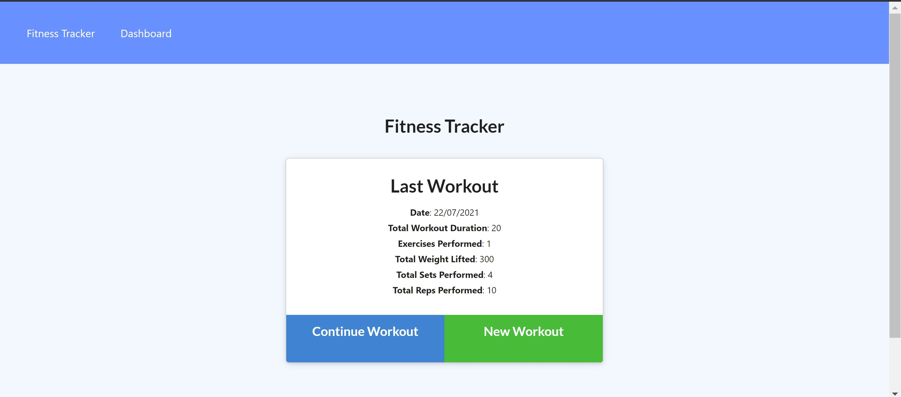
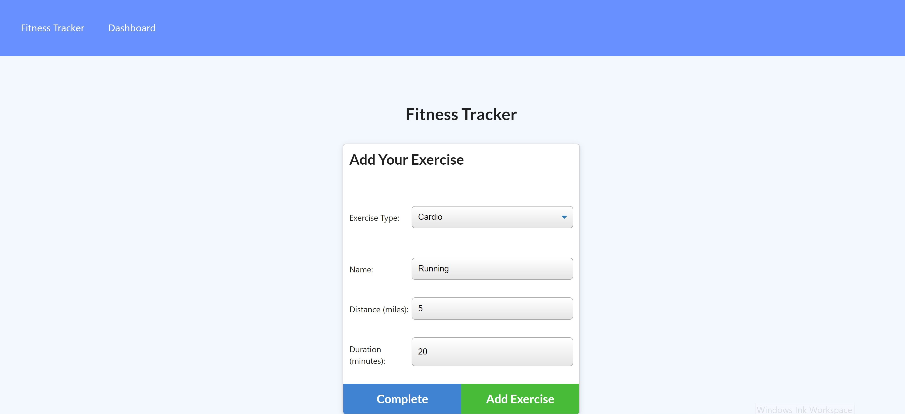

# Workout Tracker

## Description

Workout Tracker an application where you can create,view and track all your exercises. This application helps you to keep track of your daily exercises providing all informations like name,type,weight,sets,reps and duration of the exercises. This application uses Mongo database and Mongoose schema with routes handled using Express.

## Application Deployed Link

[Workout Tracker](https://fathomless-eyrie-46989.herokuapp.com/)

## Screenshots

## Table of Contents

- [Usage](#usage)

- [License](#license)

- [Test](#tests)

- [Contribute](#contribute)

- [Questions](#questions)

## Usage

Please visit the application deployed link for its usage.

## License

This project is licensed under MIT license.

## Tests

No test available at the moment but feedback is appreciated.

## Contribute

No contribution at the moment.

## Questions

For any questions, please contact

- lochan.sharad@gmail.com

- [GitHub](https://github.com/best15)
